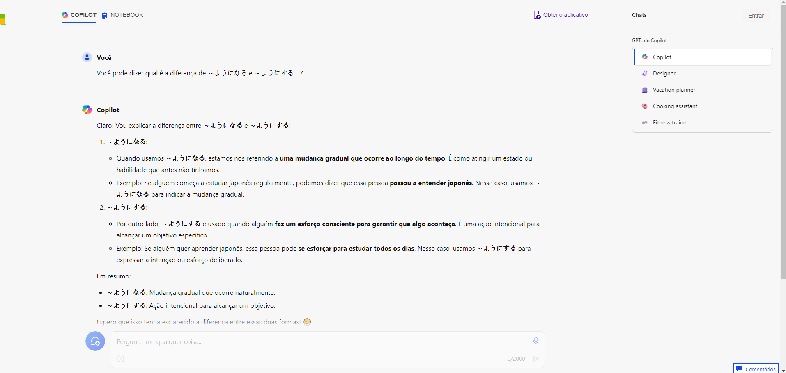
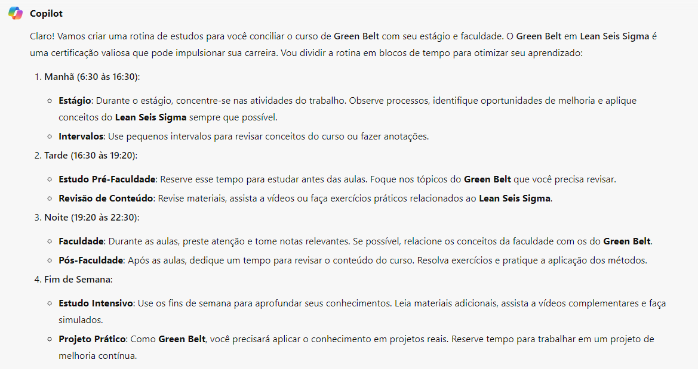

## Generative AI Challenge: Language Learning and Study Routine Optimization

  
  
  

>  Project developed as a challenge - AI-900 Preparation!

## About the project

This project uses Generative AI to help with two main challenges: understanding complex language ideas and setting up an effective study plan. By adding AI into the learning process, we want to make studying more efficient and easier to understand.
## **How to get started**

To kick off, explore the insights provided by Generative AI on language nuances and study routine optimization. These examples serve as a foundation for applying AI in my learning strategy.

### **Language Learning Insight**

#### Question:
Can you tell me what the difference is between ～ようになる and ～ようにする?

#### Answer:
Sure! I'll explain the difference between **～ようになる** and **～ようにする**:

- **～ようになる**:
  - Refers to a gradual change that occurs over time, indicating the acquisition of a new state or ability.
  - Example: Coming to understand Japanese after studying regularly.

- **～ようにする**:
  - Used when there is a conscious effort to make something happen, representing intentional action to achieve a goal.
  - Example: Making an effort to study Japanese every day.

> **Source:** conversation with Bing, 02/21/2024

### **Study Routine Optimization**

#### Question:
Create a study routine for me to do every week to study for the Green Belt course, knowing that I have an internship from 6:30 am to 4:30 pm and college from 7:20 pm to 10:30 pm from Monday to Friday.

#### Answer:
Here's an optimized routine to balance your internship, college, and the **Green Belt** course:

1. **Internship (6:30 am to 4:30 pm)**: Focus on work, applying Lean Six Sigma concepts when possible.
2. **Pre-College Study (4:30 pm to 7:20 pm)**: Dedicate this time to review Green Belt material.
3. **College (7:20 pm to 10:30 pm)**: Pay attention to classes, trying to relate concepts with the Green Belt.
4. **Weekend**: Intensive study of the Green Belt, reading additional materials, and working on practical projects.

> **Source:** conversation with Bing, 02/21/2024

## Final Considerations

Using AI for learning in schools makes studying easier and more effective. By adding AI help to language learning and study plans, we can really improve understanding and make our study time better.

## 👨‍💼 Author

<table>
  <tr>
    <td align="center">
      <a href="#">
         
        
          <b>Gian Dutra</b>
        
      </a>
    </td>
  </tr>
</table>
